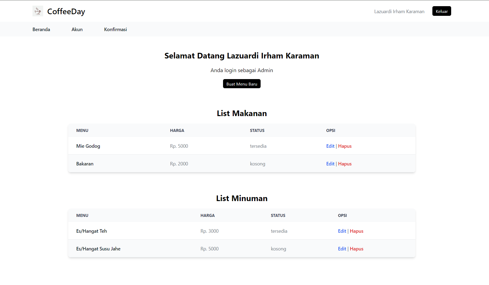
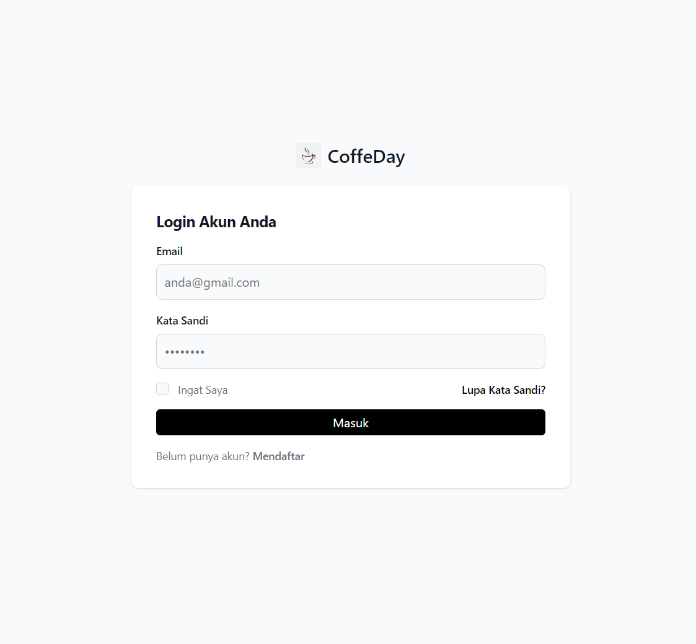
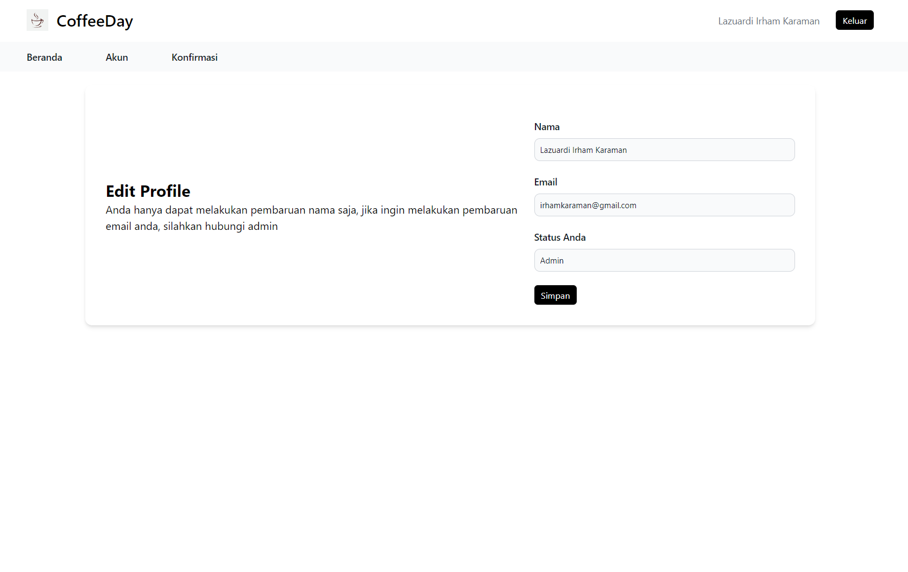

# CoffeDay



Selamat datang di CoffeDay, sistem manajemen kasir untuk kafe yang memudahkan pelanggan memesan langsung dari tempat duduk mereka melalui platform web yang elegan ini.

## Deskripsi

CoffeDay adalah proyek berbasis PHP murni yang didesain dengan prinsip Pemrograman Berorientasi Objek (PBO), dengan pengaturan routes yang canggih untuk menjaga keamanan dan konsistensi URL.

## Fitur

### Untuk Admin

- **Kelola Menu**: Tambahkan, edit, atau hapus makanan dan minuman dengan mudah.
- **Kontrol Pengguna**: Lihat dan kelola semua akun pengguna.
- **Konfirmasi Pesanan**: Proses pesanan yang masuk dengan cepat dan akurat.

### Untuk Member

- **Pesan Langsung**: Pesan makanan dan minuman favorit dari tempat duduk Anda.
- **Keranjang dan Riwayat**: Lihat keranjang belanja Anda dan lihat riwayat pesanan.

### Fitur Umum

- **Login dan Registrasi**: Mulai sesi atau daftar untuk mengakses fitur sesuai peran Anda.
- **Update Profil**: Perbarui informasi profil Anda dengan mudah dan cepat.

## Tampilan Antarmuka

### Login dan Registrasi



### Profil Pengguna



## Panduan Pengguna

1. **Mulai**: Buka halaman login dan masuk dengan akun Anda atau daftar untuk membuat akun baru.
2. **Jelajahi Menu**: Admin dapat menambahkan dan mengelola menu, sementara anggota dapat memesan dari menu yang tersedia.
3. **Kelola Pesanan**: Admin dapat memverifikasi dan mengelola pesanan yang masuk, sementara anggota dapat melihat riwayat pesanan mereka.
4. **Update Profil**: Semua pengguna dapat memperbarui informasi profil mereka untuk pengalaman yang lebih personal.

## Teknologi

Proyek ini dibangun dengan menggunakan:
- PHP murni untuk logika backend.
- HTML, CSS (dengan bantuan framework jika digunakan) untuk antarmuka pengguna.
- MySQL untuk database dan penyimpanan data.

## Cara Penggunaan

### Konfigurasi

1. Clone repository dari GitHub:

```bash
git clone https://github.com/irhamkaraman/crud-php-manajemen-kasir-kafe.git
```

2. Atur file `config.php` dengan informasi database dan URL:
```php
<?php
$currentUrl = "/crud_pemweb";
define('BASE_URL', 'http://localhost/crud_pemweb');

$db_host = 'localhost';
$db_user = 'root';
$db_pass = '';
$db_name = 'coffee_day';

$conn = mysqli_connect($db_host, $db_user, $db_pass, $db_name);

if (!$conn) {
  die("Koneksi database gagal: " . mysqli_connect_error());
}
```

## GitHub Repository

Kunjungi [GitHub repository](https://github.com/irhamkaraman/crud-php-manajemen-kasir-kafe) untuk detail lebih lanjut.

## Author

Lazuardi Irham Karaman

Mahasiswa Teknik Informatika

Universitas Muhammadiyah Ponorogo

Terima kasih telah menggunakan CoffeDay untuk pengalaman memesan yang lebih baik di kafe Anda!
