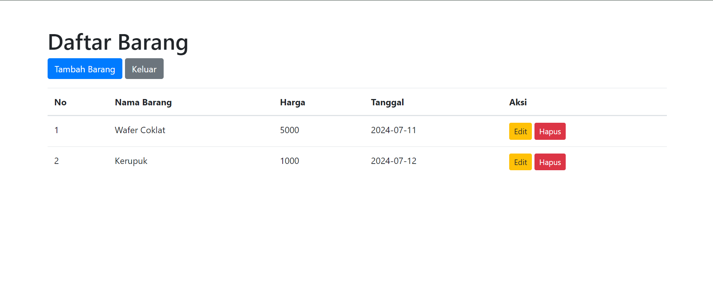

# 🛍️ Daftar Toko - Project Akhir Pemrograman Web

## Deskripsi

Project "Daftar Toko" adalah aplikasi web sederhana yang dibangun menggunakan PHP dan Bootstrap untuk mengelola daftar barang di toko. Aplikasi ini menyediakan fungsionalitas dasar untuk menambah, menampilkan, mengedit, dan menghapus data barang.

## 🚀 Fitur

- Menampilkan daftar barang dalam bentuk tabel.
- Menambahkan barang baru dengan informasi nama, harga, dan tanggal.
- Mengedit data barang yang sudah ada.
- Menghapus barang dari daftar.
- Halaman error 404 yang ramah.

## 📸 Tampilan

## 🛠️ Teknologi yang Digunakan

- PHP
- MySQL
- Bootstrap 4
- HTML
- CSS
- JavaScript

## 📂 Struktur Direktori

project-akhir/
├── Assets/
│ └── ...
├── Controller/
│ ├── BarangController.php
│ └── ErrorController.php
├── Views/
│ ├── Error/
│ │ └── 404.php
│ ├── Home/
│ │ ├── Barang/
│ │ │ ├── create.php
│ │ │ └── edit.php
│ │ └── dashboard.php
│ └── Layouts/
│ └── app.php
├── config.php
├── index.php
└── routes.php

## ⚙️ Instalasi

1. Clone repository ini: `git clone https://github.com/username/project-akhir.git`
2. Buat database MySQL dan import file `toko_db.sql` (jika ada).
3. Konfigurasi koneksi database di file `config.php`.
4. Akses aplikasi melalui browser: `http://localhost/project-akhir/`

## 👨‍💻 Kontributor

Project ini adalah karya dari:

- **Lazuardi Irham Karaman** (23533740)
- Universitas Muhammadiyah Ponorogo

## 🙏 Ucapan Terima Kasih

Terima kasih kepada dosen pengampu mata kuliah Pemrograman Web dan semua pihak yang telah membantu dalam penyelesaian project ini.